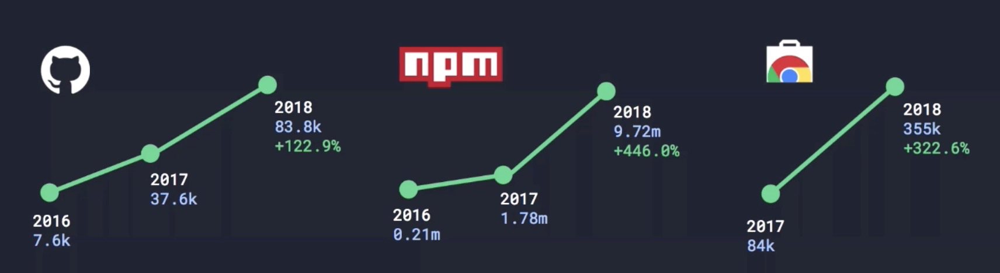

#### To view this as a slide deck:

`npm install`

`npm start`

---

<!-- .slide: data-background-video="https://cdn.flixel.com/flixel/ogd95qysaotxsgbycmxq.hd.mp4" data-background-video-loop="loop" data-background-video-muted -->

# An Overue of


<center>
  <div style="background:rgba(0,0,0,0.8);width:400px;padding:20px;font-size:0.8em !important;">
    <code>@cj</code> on Denver Devs
    <br />
    <code>cj@null.computer</code>
    <br />
    git.io/w3cj
    <br />
    <br />
    w3cj.now.sh
    <br />
    <br />
    YouTube.com/c/CodingGardenWithCJ
  </div>
</center>

---

<!-- .slide: data-background-video="https://cdn.flixel.com/flixel/ts1p4x68ezcwbofpgaw2.hd.mp4" data-background-video-loop="loop" data-background-video-muted -->

## Agenda

* whoami
* Who are you?
* What is Vue.js?
* A Brief History of Vue.js
* An OverVue of Vue.js
* Vue.js Community

---

<!-- .slide: data-background-video="https://cdn.flixel.com/flixel/52vy4yxt8yw76d2u8dsm.tablet.mp4" data-background-video-loop="loop" data-background-video-muted -->

<div class="dark-bg fragment">
  Hello friends! <span class="emoji">👋</span>
  My name is <span class="red">CJ <span class="emoji">👽</span></span>.
</div>

<div class="dark-bg fragment">
  I am a <strong>Full Stack Developer <span class="emoji">🥞</span></strong>,
  <strong>Educator <span class="emoji">🏫</span></strong>, and
  <strong>Maker <span class="emoji">🛠</span>
  </strong> based in the <strong>Denver <span class="emoji">🏔</span></strong> area.
</div>

----

<!-- .slide: data-background-video="https://cdn.flixel.com/flixel/c8t92d7m4t5w4af4gmnc.hd.mp4" data-background-video-loop="loop" data-background-video-muted -->

<div class="dark-bg">
  I have worn many <span class="emoji">🎩</span>s in my career including <strong>Instructor <span class="emoji">👨‍🏫</span></strong>, <strong>Software Engineer <span class="emoji">🚂</span></strong>, <strong>QA Analyst <span class="emoji">🚨</span></strong>, <strong>System Administrator <span class="emoji">🔥</span></strong>, and <strong>Help Desk Consultant <span class="emoji">⛑</span></strong>.
</div>

----

## Raise your hand if I have ever helped you debug some code.

----

<!-- .slide: data-background="http://galvanize-wp.s3.amazonaws.com/wp-content/uploads/2016/09/14143218/Platte-Oct-2015-4593-min.jpg"  -->

<div class="dark-bg">
  <h3>Lead Instructor, Principal Full Stack Developer</h3>
  <h2>at</h2>
  
</div>

----

<!-- .slide: data-background-video="https://cdn.flixel.com/flixel/ilek20y92dy1h38jx4j5.hd.mp4" data-background-video-loop="loop" data-background-video-muted -->

### I'm currently seeking my next adventure...

----

<!-- .slide: data-background-video="https://flixels.s3.amazonaws.com/flixel/8gg0il08d91lvga9gsme.tablet.mp4" data-background-video-loop="loop" data-background-video-muted -->

<a target="\_blank" href="https://makervan.life">
  
</a>

<div class="dark-bg">
  <h3>@makervanlife on instagram</h3>
</div>

----

### Coding Garden with CJ

YouTube.com/c/CodingGardingWithCJ

Live stream schedule at https://coding.garden


----

<!-- .slide: data-background="https://i.imgur.com/WPiNCVH.png"  -->

<div class="dark-bg">
  I am a co-organizer of the Dener ue Meetup
</div>

<div class="dark-bg fragment mt">
  We are currently looking for food and drink sponsors.
  We're always looking for full talk and lightning talk speakers.
</div>

----

## Frontend Framework Experience

* 2+ years working with Angular 1.x
  * 3 Angular 1.x apps in production
* ~1 year working with React/Redux
  * 1 React/Redux Application in Production
* ~1.5 years working with Vue.js 2.x
  * 4 Vue.js 2.x apps in production
* 10+ toy projects playing around with frontend frameworks

---

<!-- .slide: data-background-video="https://cdn.flixel.com/flixel/14hemjzawc4tl7heatqw.hd.mp4" data-background-video-loop="loop" data-background-video-muted -->

<div style="background: rgba(0, 0, 0, 0.4);">
  <h1>Who are you?</h1>
</div>

----

## Show of hands:
# Who writes JavaScript daily?

----

## Show of hands:
# Who has used a front-end JS framework?

----

## Show of hands:
# Who has heard of Vue.js before this talk?

----

## Show of hands:
# Who has never used Vue.js?

----

## Show of hands:
# Who has used Vue.js in a project?

----

## Show of hands:
# Who uses Vue.js daily?

---

<!-- .slide: data-background-video="https://cdn.flixel.com/flixel/sjytbnalz6tpbgl9jqzn.hd.mp4" data-background-video-loop="loop" data-background-video-muted -->

<div class="dark-bg">
  <h1>What is Vue.js?</h1>
</div>

----

# The Progressive JavaScript Framework

----

### A progressive, incrementally-adoptable JavaScript framework for building UI on the web.

----


----


----

# Approachable

Already know HTML, CSS and JavaScript? Read the guide and start building things in no time!

----

# Versatile

Simple, minimal core with an incrementally adoptable stack that can handle apps of any scale.

----

# Performant

* 20kb min+gzip Runtime
* Blazing Fast Virtual DOM
* Minimal Optimization Efforts

---

<!-- .slide: data-background-video="https://cdn.flixel.com/flixel/h1pnkz1q4exz9wy0d70a.hd.mp4" data-background-video-loop="loop" data-background-video-muted -->

# A Brief History of Vue.js

----

<!-- .slide: data-background-image="https://i.imgur.com/UNiECAO.jpg" -->

<div class="dark-bg">
  <h2>Evan You</h2>
  <p>Vue.js was created by Evan You in late 2013 while working at google.</p>
</div>


----

>My job at Google involved a lot of prototyping in the browser. We had this idea and we wanted to get something tangible as fast as possible. Some of the projects used Angular at that time. For me, Angular offered something cool which is data binding and a data driven way of dealing with a DOM, so you don’t have to touch the DOM yourself. It also brought in all these extra concepts that forced you to structure the code the way it wanted you to. It just felt too heavy for the use case that I had at that time.

`- Evan You, Interview 2017`

[Between the Wires: An interview with Vue.js creator Evan You
](https://medium.freecodecamp.org/between-the-wires-an-interview-with-vue-js-creator-evan-you-e383cbf57cc4)

----

>I figured, what if I could just extract the part that I really liked about Angular and build something really lightweight without all the extra concepts involved?

`- Evan You, Interview 2017`

[Between the Wires: An interview with Vue.js creator Evan You
](https://medium.freecodecamp.org/between-the-wires-an-interview-with-vue-js-creator-evan-you-e383cbf57cc4)

----

## Notable Events

* February 2014 - [Released on github](http://blog.evanyou.me/2014/02/11/first-week-of-launching-an-oss-project/)
* April 2015 - [Tweet from Taylor Otwell](https://twitter.com/taylorotwell/status/590281695581982720?lang=en) (Creator of Laravel - PHP Framework)
* September 2016 - Vue.js 2.0 released
* June 2017 - The first official VueConf in Poland
* 2017 - Single most starred repo on Github
* February 2018 - VueConf Amsterdam
* March 2018 - VueConf US - New Orleans

----

### Growth of Vue



----

# Vue.js Today

* [Github](https://github.com/vuejs/vue)
* [Github Star history](http://www.timqian.com/star-history/#vuejs/vue)
* [npm](https://www.npmjs.com/package/vue)

----

## Version Timeline

* VueJS (v0.6.0 released on 8 Dec 2013)
* Animatrix (v0.9.0 released on 25 feb 2014)
* Blade Runner (v0.10.0 released on 23 Mar 2014)
* Cowboy Bepob (v.0.11.0 released on 7 Nov 2014)
* Dragon Ball (v.0.12.0 released on 12 Jun 2015)
* Evangelion (v.1.0.0 released on 27 Oct 2015)
* Ghost in the Shell (v.2.0.0 released on 30 Sep 2016)
* Hunter X Hunter (v.2.1.0 released on 22 Nov 2016)
* Initial D (v.2.2.0 released on 26 Feb 2017)
* JoJo's Bizarre Adventure (v.2.3.0 released on 27 Apr 2017)
* Kill la Kill (v.2.4.0 released on 13 Jul 2017)
* Level E (v.2.5.0 released on 12 Oct 2017)

---

<!-- .slide: data-background-video="https://cdn.flixel.com/flixel/jjihphnwquisxx0xyxtg.phone.mp4" data-background-video-loop="loop" data-background-video-muted -->

# OverVue of Vue.js
* Getting Started
* Vue.js CLI
* Vue.js Directives
* Vue.js Components
* Vue.js Router*
* Vue.js Reactivity*
* Vue.js State Management*

---

<!-- .slide: data-background-video="https://cdn.flixel.com/flixel/1732iv96pd4mp6zx6xwa.hd.mp4" data-background-video-loop="loop" data-background-video-muted -->

## Getting Started

----

```js
new Vue({
  el: '#app',
  data: {
    message: 'Hello Friends!'
  }
})
```

```html
<main id="app">
  <h2>{{message}}</h2>
</main>
```

----

# To the [Docs](https://vuejs.org)!

---

<!-- .slide: data-background-video="https://cdn.flixel.com/flixel/167945eofe3pcg9z9y61.tablet.mp4" data-background-video-loop="loop" data-background-video-muted -->

<div class="dark-bg">
  <h1>Vue.js CLI</h1>
</div>

----

## Vue CLI v2

```sh
# install vue-cli v2
$ npm install -g vue-cli
# create a project using the webpack template
$ vue init webpack my-project
$ cd my-project
$ npm install
$ npm run dev
```

----

## Templates

* simple - The simplest possible Vue setup in a single HTML file
* webpack-simple - A simple Webpack + vue-loader setup for quick prototyping.
* browserify-simple - A simple Browserify + vueify setup for quick prototyping.
* webpack - A full-featured Webpack + vue-loader setup with hot reload, linting, testing & css extraction.
* pwa - PWA template for vue-cli based on the webpack template
* browserify - A full-featured Browserify + vueify setup with hot-reload, linting & unit testing.

### Custom Templates

```sh
vue init username/repo my-project
```

----

## Vue CLI v3

```sh
# install vue-cli v3
$ npm install -g @vue/cli
# create a project and choose your plugins
$ vue create my-project
```

---

<!-- .slide: data-background-video="https://cdn.flixel.com/flixel/u08ojgwwslba0ghx53on.hd.mp4" data-background-video-loop="loop" data-background-video-muted -->

<div class="dark-bg">
  <h1>Vue.js Directives</h1>
</div>

----

* Conditionals
  * v-if/v-else
  * v-show
* Loops
  * v-for
* Handling User Input
  * v-on:event
  * v-model
* Class and Style
  * v-bind:class
  * v-bind:style

----

## Shorthands

```html
<!-- full syntax -->
<a v-bind:href="url"></a>
<!-- shorthand -->
<a :href="url"></a>
```

```html
<!-- full syntax -->
<a v-on:click="doSomething"></a>
<!-- shorthand -->
<a @click="doSomething"></a>
```

---

<!-- .slide: data-background-video="https://cdn.flixel.com/flixel/bane1smc4639qj931ujq.hd.mp4" data-background-video-loop="loop" data-background-video-muted -->

# Vue.js Components

----


----

```html
<div id="app">
  <app-nav></app-nav>
  <app-view>
    <app-sidebar></app-sidebar>
    <app-content></app-content>
  </app-view>
</div>
```

----

```js
Vue.component('talk-item', {
  template: '<li>OverVue of Vue.js</li>'
});
```

```html
<ul>
  <talk-item></talk-item>
</ul>
```

----

## Props


```js
new Vue({
  el: '#app',
  data: {
    talks: [
      'OverVue of Vue.js',
      'VueConf Re-Cap'
    ]
  }
})
```

----

```js
Vue.component('talk-item', {
  props: ['talk'],
  template: '<li>{{talk}}</li>'
});
```

----

```html
<main id="app">
  <ul>
    <talk-item
      v-for="talk in talks"
      :talk="talk">
    </talk-item>
  </ul>
</main>
```

----

## Vue.js Single File Components

----


----

## Vue.js Single File Components
* Imported as an ES2015 module
* Collocation of Template, Logic and Style
* Use what you know: HTML, CSS, JavaScript
* Embedded pre-processor support: seamlessly use Babel, SASS, Less or even Pug in the same file
* Hot-reload out of the box
* Scoped CSS

----

## [Vue Life Cycle Hooks](https://vuejs.org/v2/guide/instance.html#Lifecycle-Diagram)

---

<!-- .slide: data-background-video="https://cdn.flixel.com/flixel/rebln7j1jqwq3c8d0fw3.tablet.mp4" data-background-video-loop="loop" data-background-video-muted -->

# Vue.js Router

----

# [vue-router](https://router.vuejs.org/en/)

----

```sh
$ npm install vue-router
```

```js
import Vue from 'vue';
import VueRouter from 'vue-router';
import router from './router';

Vue.use(VueRouter);

new Vue({
  ...
  router,
  ...
});
```

```html
<router-view></router-view>
```

----

## Vue Router
* Officially-supported by Vue.js
* Nested route/view mapping
* Modular, component-based router configuration
* Route params, query, wildcards
* View transition effects powered by Vue.js' transition system
* Fine-grained navigation control
* Links with automatic active CSS classes
* HTML5 history mode or hash mode, with auto-fallback in IE9
* Customizable Scroll Behavior

----

## [Router Link](https://router.vuejs.org/en/api/router-link.html)

```html
<router-link :to="{ name: 'user', params: { userId: 123 }}">
  User
</router-link>
```

---

<!-- .slide: data-background-video="https://cdn.flixel.com/flixel/crmoqzfoajbuq0uwubiz.tablet.mp4" data-background-video-loop="loop" data-background-video-muted -->

<div class="dark-bg">
  <h1>Vue.js Reactivity</h1>
</div>

----


----

### Limitations

* Vue cannot detect [property addition](https://vuejs.org/v2/guide/reactivity.html#Change-Detection-Caveats)

```js
// Vue.set(object, key, value)
this.$set(this.someObject, 'b', 2)
```

---

<!-- .slide: data-background-video="https://cdn.flixel.com/flixel/yqaf3nj6lrakowekph7r.tablet.mp4" data-background-video-loop="loop" data-background-video-muted -->

<div class="dark-bg">
  <h1>Vue.js State Management</h1>
</div>

----

### [Simple State Management from Scratch](https://vuejs.org/v2/guide/state-management.html)

```js
const sourceOfTruth = {}
const vmA = new Vue({
  data: sourceOfTruth
})
const vmB = new Vue({
  data: sourceOfTruth
})
```

----


----

## Complex State Management
* [Vuex](https://vuex.vuejs.org/en/) - Elm-inspired (flux/redux) state management library
  * Based on the idea that POJOs can be reactive

---

<!-- .slide: data-background-video="https://cdn.flixel.com/flixel/602x1s1bl1k5j6yks6ea.hd.mp4" data-background-video-loop="loop" data-background-video-muted -->

<div class="dark-bg">
  <h1>Awesome Vue.js</h1>
</div>

----

<a href="https://github.com/vuejs/awesome-vue">

</a>

---

<!-- .slide: data-background-video="https://cdn.flixel.com/flixel/ez3tqe8xzerp9tark1m1.tablet.mp4" data-background-video-loop="loop" data-background-video-muted -->

<div class="dark-bg">
  <h1>Vue.js Community</h1>
</div>

----

* Denver Vue.js Meetup
* [Forum](http://forum.vuejs.org/): The best place to ask questions and get answers about Vue and its ecosystem.
* [Chat](https://chat.vuejs.org/): A place for Vue devs to meet and chat in real time.
* [The “Show and Tell” Subforum](http://forum.vuejs.org/c/show-and-tell): Another great place to check out what others have built with and for the growing Vue ecosystem.

----

## [Support Evan You on Patreon!](https://www.patreon.com/evanyou)

---

# ?

---


<!-- .slide: data-background-video="https://cdn.flixel.com/flixel/ogd95qysaotxsgbycmxq.hd.mp4" data-background-video-loop="loop" data-background-video-muted -->

# Thank ue!

<center>
  <div style="background:rgba(0,0,0,0.8);width:400px;padding:20px;font-size:0.8em !important;">
    <code>@cj</code> on Denver Devs
    <br />
    <code>cj@null.computer</code>
    <br />
    git.io/w3cj
    <br />
    <br />
    w3cj.now.sh
    <br />
    <br />
    YouTube.com/c/CodingGardenWithCJ
  </div>
</center>
